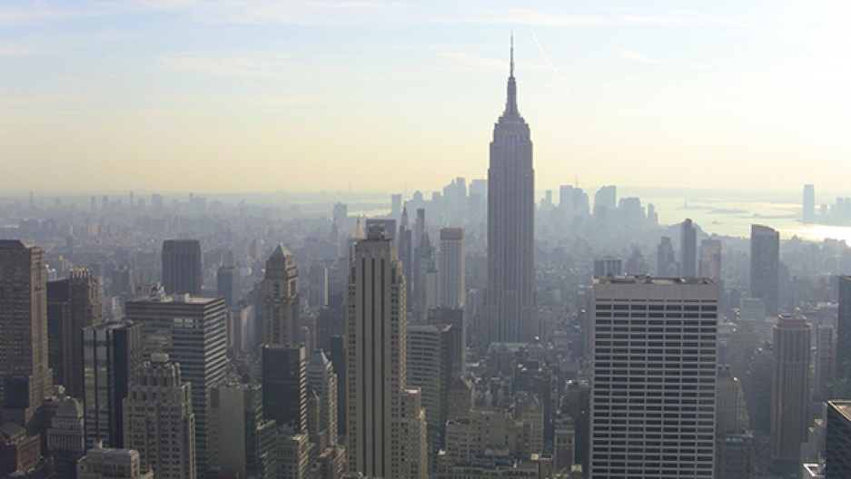
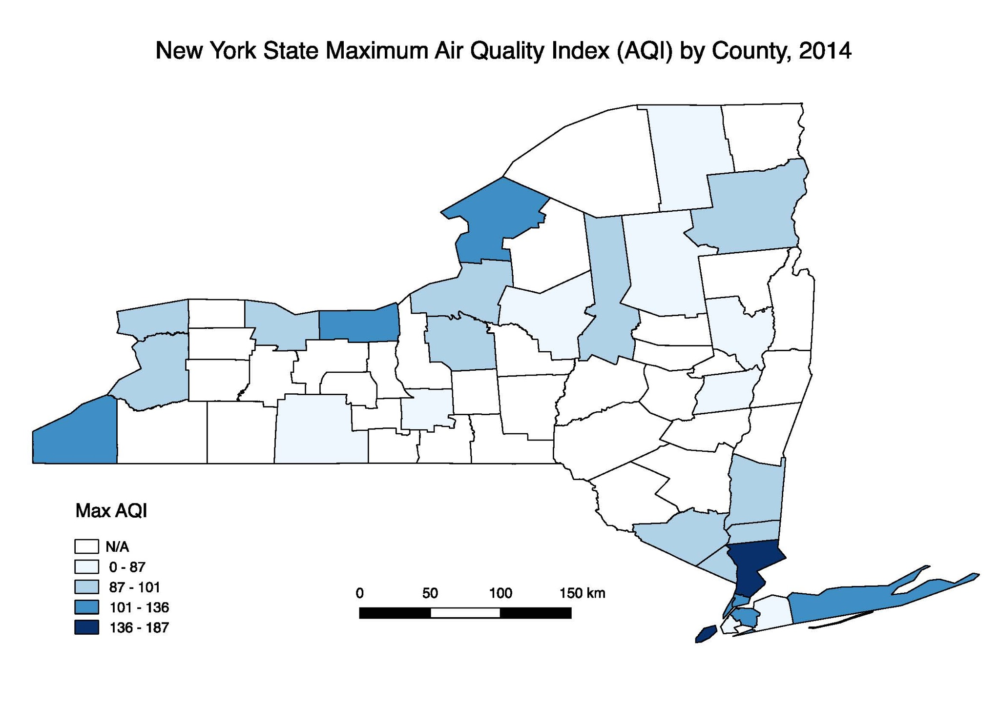

  

```{r setup, include=FALSE}
knitr::opts_chunk$set(
  collapse = TRUE,
  out.width = "90%"
)

library(tidyverse)
library(modelr)
library(mgcv)

theme_set(theme_bw() + theme(legend.position = "bottom"))
```


## Motivation

Unlike many factors we can control in determining our health, ambient (outdoor) air quality is almost impossible to alter. It accounts for significant morbidity and, indirectly, to mortality around the world. We were interested in how air pollution in New York State, measured through proxies such as PM2.5, ozone and air quality index (AQI), may lead to the acute exacerbation of chronic conditions like cardiovascular diseases and asthma as well as acute cardiovascular symptoms. Our goal is to illustrate trends in the relationship between air quality and acute health outcomes and areas (geographically and scientifically) requiring future research.  

## Background

When someone breathes, they are exposed not to a single compound in isolation but rather to a mixture of compounds. Two compounds that are known to confer toxicity are ozone and fine particulate matter (PM2.5). Ozone is a fat soluble chemical than can bypass absorption in the upper respiratory system and penetrate down into the alveoli. PM2.5 is a tiny particle that, due to its size, can also travel deep into the alveoli. Both PM2.5 and ozone can have harmful local effects in the respiratory system and, because of their ability to cross from the lung into the bloodstream, can have harmful distal effects throughout the cardiovascular system.  


## Related Work

Research conducted by Dr. Frederica Perera, Dr. Marianthi-Anna Kioumourtzoglou, and others at the Center for Children's Environmental Health, Columbia University, as well as previous classwork utilizing NOAA data inspired us to explore environmental data. Throughout our studies, we have learned that air pollution is known to have detrimental effects on human health. For instance, [high PM2.5](https://www.ncbi.nlm.nih.gov/pmc/articles/PMC5260007/) and [ozone exposure](https://www.atsjournals.org/doi/abs/10.1164/rccm.201811-2106ED) causes damage to the respiratory system, which puts individuals at risk for health outcomes like asthma and heart disease. We became personally interested in the harmful effects of air pollution upon learning that New York ranks tenth in [most polluted cities (by ozone)](https://www.lung.org/our-initiatives/healthy-air/sota/city-rankings/most-polluted-cities.html) in the United States.  


## Data Sources

For our data analysis, we used data from 

* [New York State DOH Health Data](https://data.ny.gov/browse?category=Health&utf8=%E2%9C%93) 
* [NYCDOH Environment and Health Data Portal](http://a816-dohbesp.nyc.gov/IndicatorPublic/publictracking.aspx), 
* [United States Environmental Protection Agency Air Data](https://www.epa.gov/outdoor-air-quality-data). 

Visit our [Data](data.html) tab to read more about our data sets. 

To access the CSV files used, [click here](https://drive.google.com/drive/u/0/folders/1_3HhtUXWRW23bItsjk7FQMvZp1NuCZma)

## Exploratory Analysis

We started our exploratory analysis looking at trends of PM2.5 concentrations in New York state over time. 

```{r load_clean_pm_dataset, message=FALSE, warning = FALSE, echo=FALSE, output=FALSE}
PM_county_NYS = read_csv("./data/PM2.5_county_NYS.csv") %>%
  janitor::clean_names() %>%
  select(county_name, year, output, measure) %>%
  separate(county_name, into = c("county", "delete", sep = " ")) %>% 
  select(-delete) %>%
  mutate(county = recode(county, `New` = "New York")) %>% 
  select(county, year, output, measure)
```

```{r plot_pm_00_17, echo=FALSE, message=FALSE}
PM_plot_conc_allyears = PM_county_NYS %>%
  filter(measure == "Micrograms/cubic meter (LC)") %>%
  group_by(county, year) %>%
  ggplot(aes(x = year, y = output, color = county)) + 
  geom_line() + 
  labs(title = "Ambient PM2.5 Concentrations in New York State, 2000-2017", 
       x = "Year", 
       y = "PM2.5 (ug/m3)")

PM_plot_conc_allyears
```

Over 2000-2017, levels of PM2.5 across all counties in New York State have steadily decreased. 


Visit [Explore](explore.html) to learn about the rest of our exploratory analysis.

## Results and Discussion

If you're interested in seeing the model building process, [click here](https://github.com/anjilean/p8105_final_project_AAAD/blob/master/model_building.md). 


Our [visualizations](plots.html) highlight large disparities in rate of hospitalizations for asthma and cardiovascular disease at the county level. Most noticeably, Bronx County has more than double the amount of asthma hospitalizations per 10,000 population than any other county. The plots of ambient PM2.5 against asthma admission rates show that Bronx County falls towards the higher range of PM2.5 as a clear outlier, whereas the rest of the points follow a clear positive trending line. New York County has the highest plotted PM2.5. An interesting finding is that four out of the five boroughs of New York City (missing Richmond County, or Staten Island) are in the top 5 of asthma hospitalizations. This is not surprising because New York City is a large urban center with more possible pollutants to drive the rate of hospitalizations. 

Bronx County also rises above all other counties in terms of age-adjusted cardiovascular disease hospitalizations. This difference is less pronounced for asthma hospitalizations. The other New York City borough in the top five is Kings County (Brooklyn). The plot of CVD and ambient PM 2.5 does not have as clear of a positive linear trend; it shows the available data clustered in the middle range of values for hospitalizations. We are somewhat surprised by the results given our hypothesis that ambient air quality would negatively affect CVD hospitalizations similarly to asthma hospitalizations. This suggests that additional covariates should be considered and that the exposure and disease mechanisms may be different for asthma than for CVD. 

Examining our final models and their corresponding RMSE violin plots, we see that the adjusted model is better for both asthma and CVD hospitalizations. The asthma model is moderately well-fitted with an R-squared value of 0.4044, whereas the CVD model is not well-fitted with an R-squared value of 0.0488.  

### Limitations

  

A major limitation of this analysis was missing data. Throughout the exploration phase, we identified various measures of air quality for New York state that were incomplete. Although there are standards in place, definitions of air and air quality are not consistent  across the different publicly available data sources that we examined. Additionally, certain counties in New York State did not have any PM2.5 data available, so we used US EPA Air Quality Index measures instead, as illustrated in the figure above.

Missing data also created challenges when looking at hospitalization rates for asthma and CVD across New York State. The final analysis shows a plot for CVD hospitalizations from 2012-2014, while the asthma hospitalization plot is only for 2014. This inconsistency makes it challenging to draw comparisons across the two plots.

Additionally, there could be other measures of health outcome rates for CVD and asthma besides hospitalization rates. Hospitalization rates may not be an accurate representation of true rates of diseases because hospital access and other factors, such as insurance status, might impact a person’s decision to go to a hospital.  

### Conclusion and Future Directions

The analysis confirms that ambient PM2.5 exposure is associated with asthma and CVD, using hospitalization rates as the proxy indicator. New York City counties, including the Bronx and New York, have high ambient PM2.5 exposure. Bronx County has the highest number of hospitalizations per 10,000 people for both asthma and CVD. Our analysis shows that exposure to ambient PM2.5 does not account for all the disparity in hospitalization rates seen in Bronx county, although it does account for some of it. Air quality interventions should be focus their resources in Bronx and New York counties. 

Future studies should investigate measures of air quality that are consistently collected for improved comparability. Additionally, for the purposes of answering this research question, it would be useful to incorporate different indicators for asthma and CVD beyond hospitalization rates. Finally, we would recommend looking for data beyond what is publicly available to get a more complete picture of what is occurring across New York state. 